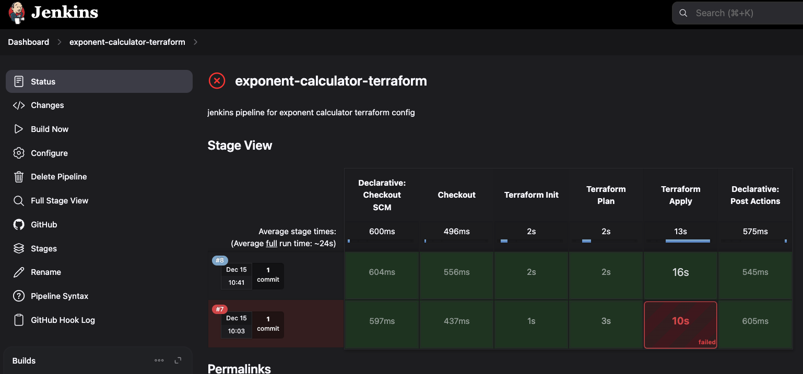

# Exponent Web App
Full-stack DevOps project using Terraform, AWS, Jenkins, Javascript and REST APIs

## Project Overview
This project uses a simple exponent calculator web application with a complete CI/CD pipeline and cloud infrastructure. When users input a base number and exponent, the application calculates the result and stores the data in a database.

### Architecture
- **Frontend**: Static website hosted on AWS Amplify
- **Backend**: 
  - API Gateway for REST endpoints
  - Lambda function (Python) for calculations
  - DynamoDB for data storage
  - S3 for long-term data archival
  - Athena for data querying


### Technology Stack
- **Infrastructure as Code**: Terraform
- **Cloud Provider**: AWS
- **CI/CD**: Jenkins
- **Version Control**: GitHub

## Repository Structure
```
exponent-website/
├── terraform/         # Infrastructure as Code
├── aws-scripts/       # Lambda functions
├── webpage/          # Static website files
└── Jenkinsfile       # CI/CD pipeline configuration
```

## Data Flow
### 1. User enters numbers and name on web interface


### 2. Interface is hosted on Amplfiy


### 3. API Gateway receives request


### 4. Lambda function processes calculation


### 5. Results stored in DynamoDB


### 6. IAM role for Lambda access to DynamoDB


### 7. Data automatically archived to S3 


### 8. Historical data queryable via Athena


### 9. Updates to repo and automatically applied using Jenkins

